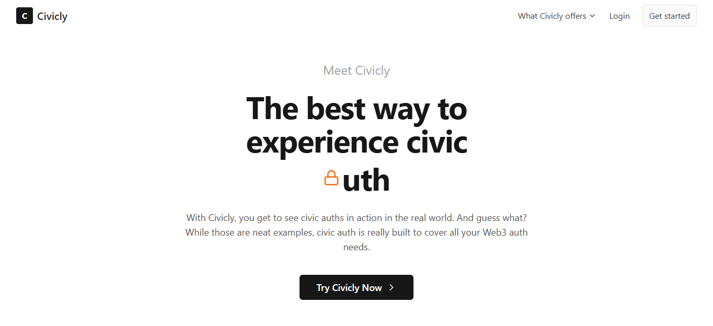
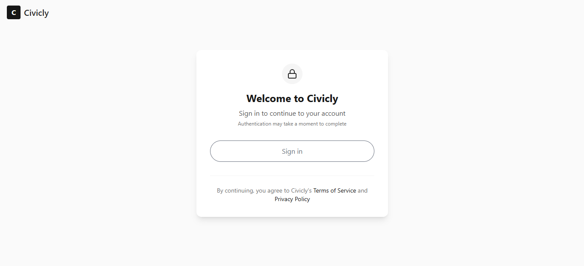
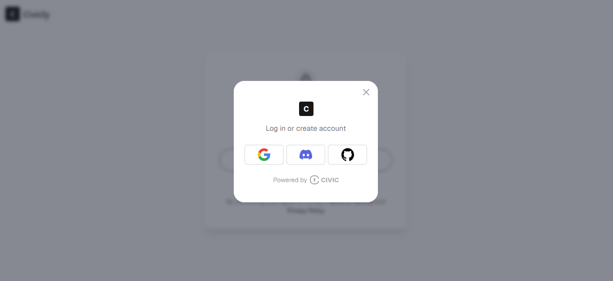
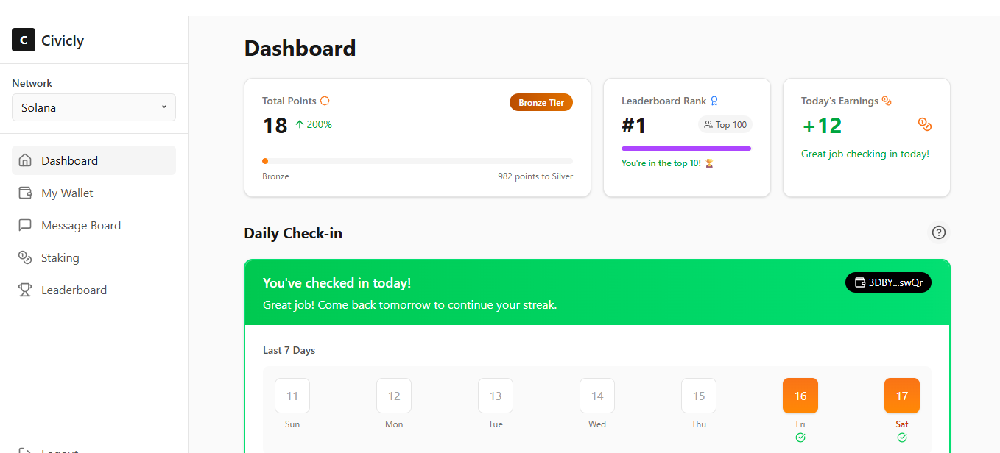
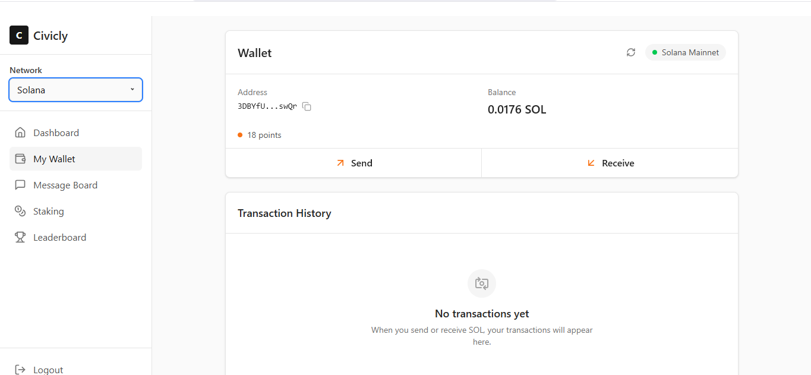
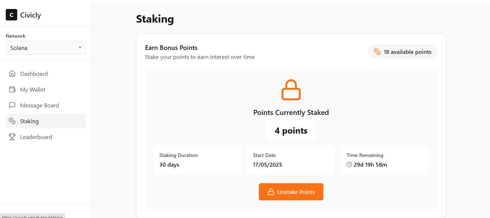
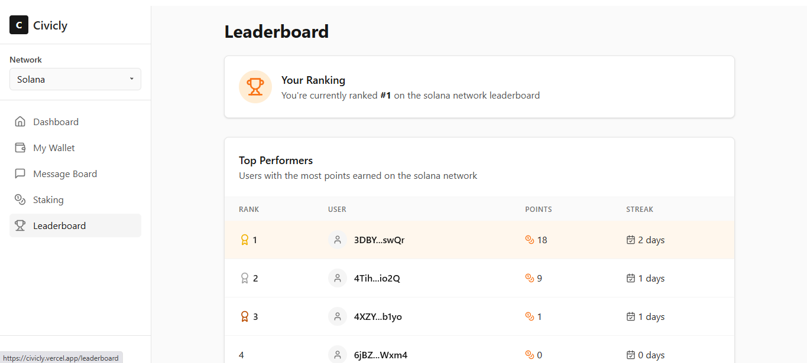
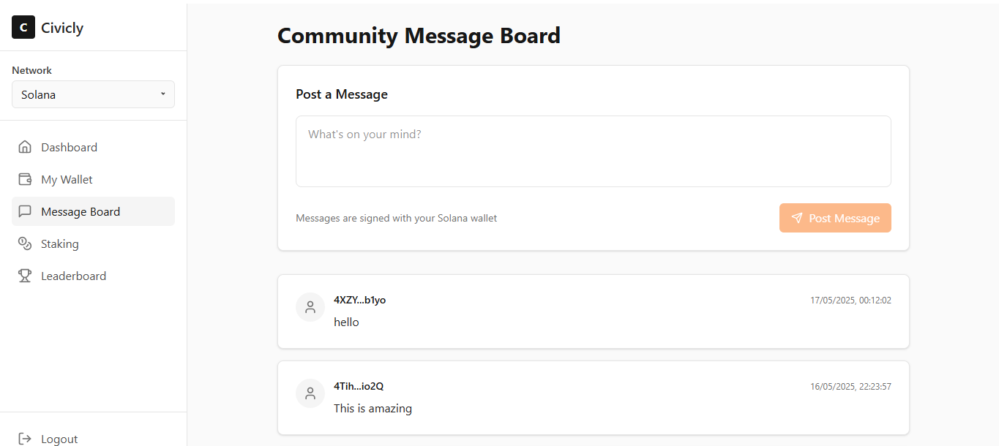
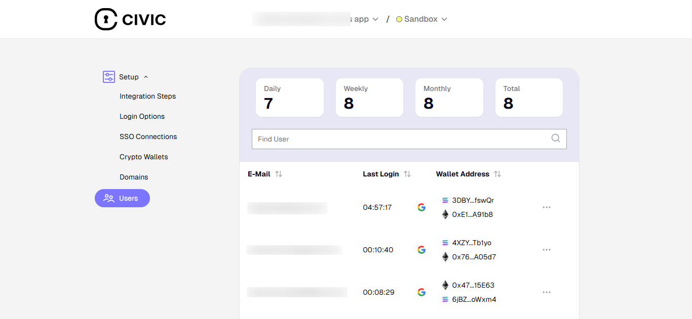

# Civicly

Civicly is a platform that demonstrates the power of Civic Auth - a decentralized authentication and user management solution with embedded Solana and Ethereum/EVM wallets. Users can sign in, earn points through daily check-ins, stake points, and interact with other users on a message board.

## Contents

- [Features](#features)
- [Live Demo](#live-demo)
- [Screenshots](#screenshots)
- [How to Use Civicly](#how-to-use-civicly)
- [Developer Setup](#developer-setup)
- [Key Components](#key-components)
- [Getting Civic Auth Credentials](#getting-civic-auth-credentials)

## Features

- **Web3 Authentication**: Sign in using Google, Discord, or GitHub through Civic Auth
- **Embedded Wallets**: Automatically creates Solana and Ethereum wallets for users
- **Daily Check-ins**: Earn points by signing in daily
- **Points System**: Accumulate points and view your ranking on the leaderboard
- **Staking**: Stake your points to earn interest over time
- **Message Board**: Send and view messages from other users (with cryptographic signing)
- **Wallet Management**: View your wallet balance and transaction history

## Live Demo

Visit [civicly.vercel.app](https://civicly.vercel.app) to see the platform in action.

## Screenshots

### Home Page


### Login Screen




### Dashboard


### Wallet Page


### Staking


### Leaderboard


### Message Board


## How to Use Civicly

1. Visit [civicly.vercel.app](https://civicly.vercel.app)
2. Click on either "Try Civicly Now", "Login", or "Get Started" button
3. Choose your preferred authentication method (Google, Discord, or GitHub)
4. Complete the authentication process (you may receive a verification code by email)
5. Once logged in, you'll see your dashboard with your points and daily check-in status

6. Navigate through the sidebar to access different features:

   - **Dashboard**: View your points, leaderboard rank, and check in daily
   - **My Wallet**: Manage your Solana and Ethereum wallets, send and receive crypto
   - **Message Board**: Post messages and see what others have shared
   - **Staking**: Stake your points to earn interest
   - **Leaderboard**: See how you rank compared to other users

## Developer Setup

To set up Civicly locally for development:

1. Clone the repository:

   ```bash
   git clone https://github.com/yourusername/civicly.git
   cd civicly
   ```

2. Install dependencies:

   ```bash
   npm install
   ```

3. Create a `.env` file in the root directory with the following variables:
  
   ```
   DATABASE_URL=your_database_connection_string
   NEXT_PUBLIC_CIVIC_CLIENT_ID=your_civic_client_id
   NEXT_PUBLIC_HELIUS_API_KEY=your_helius_api_key
   ```

4. Set up the database:
   ```bash
   npx prisma migrate dev
   npx prisma generate
   ```

5. Build and run the application:
   ```bash
   npm run build
   npm run dev
   ```

6. Open [http://localhost:3000](http://localhost:3000) in your browser

## Key Components

### Auth Components

The core of the Civic Auth integration is the `UserButton` component:

```jsx
import { UserButton, useUser } from "@civic/auth-web3/react";

function LoginPage() {
  return (
    <div className="flex justify-center mb-8">
      <UserButton className="w-full py-3 px-4" />
    </div>
  );
}
```

This single component provides a complete authentication solution including:
- Login with social providers (Google, Discord, GitHub)
- Account creation
- Session management
- Logout functionality

### Auth Middleware

The middleware ensures that only authenticated users can access protected routes:

```typescript
// middleware.ts
import { authMiddleware } from "@civic/auth-web3/nextjs/middleware";

export default authMiddleware();

export const config = {
  matcher: [
    "/((?!_next|api/auth|auth|login|callback|signin|signout|favicon.ico|sitemap.xml|robots.txt|.*\\.jpg|.*\\.png|.*\\.svg|.*\\.gif).*)",
  ],
};
```

### Civic Auth API Route

This handles login and logout requests:

```typescript
// app/api/auth/[...civicauth]/route.ts
import { handler } from "@civic/auth-web3/nextjs";

export const GET = handler();
export const POST = handler();
```

### Root Layout with Providers

The root layout sets up all necessary providers:

```jsx
// app/layout.tsx
"use client";

import { QueryClient, QueryClientProvider } from "@tanstack/react-query";
import { WagmiProvider, createConfig, http } from "wagmi";
import { embeddedWallet } from "@civic/auth-web3/wagmi";
import { mainnet } from "wagmi/chains";
import { CivicAuthProvider } from "@civic/auth-web3/nextjs";
import { ConnectionProvider, WalletProvider } from "@solana/wallet-adapter-react";
import { WalletModalProvider } from "@solana/wallet-adapter-react-ui";

const wagmiConfig = createConfig({
  chains: [mainnet],
  transports: {
    [mainnet.id]: http(),
  },
  connectors: [embeddedWallet()],
});

const queryClient = new QueryClient();

export default function RootLayout({ children }) {
  const heliusApiKey = process.env.NEXT_PUBLIC_HELIUS_API_KEY;
  const endpoint = `https://mainnet.helius-rpc.com/?api-key=${heliusApiKey}`;
  
  return (
    <html lang="en">
      <body>
        <QueryClientProvider client={queryClient}>
          <WagmiProvider config={wagmiConfig}>
            <ConnectionProvider endpoint={endpoint}>
              <WalletProvider wallets={[]} autoConnect>
                <WalletModalProvider>
                  <CivicAuthProvider>
                    {children}
                  </CivicAuthProvider>
                </WalletModalProvider>
              </WalletProvider>
            </ConnectionProvider>
          </WagmiProvider>
        </QueryClientProvider>
      </body>
    </html>
  );
}
```

## Getting Civic Auth Credentials

1. Visit [auth.civic.com](https://auth.civic.com/)
2. Create an account or sign in
3. Set up a new project
4. When configuring your project, make sure to select the Web3 wallet option
5. Add your application details including authorized domains and redirect URLs
6. Once configured, you'll receive your Client ID
7. Add this Client ID to your project's `.env` file as `NEXT_PUBLIC_CIVIC_CLIENT_ID`

From the Civic dashboard, you can:

- Monitor user activity



- Manage application settings
- View analytics for your authentication service
- Configure additional authentication providers

## Important Notes

- This application requires a Helius API key for Solana RPC access
- Make sure to set up your database properly with Prisma
- The application uses Next.js App Router for routing

---

>All images are in the `readme-images` inside `public` folder/directory.

Built with ❤️ using Next.js, Civic Auth, Ethereum, and Solana